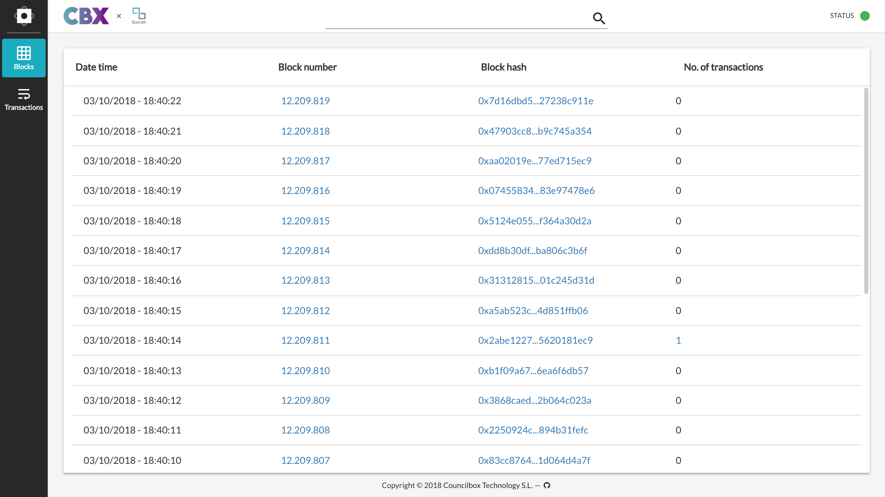
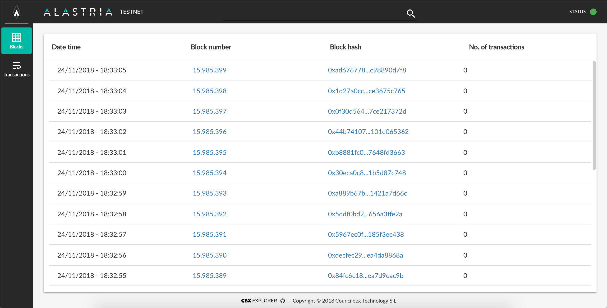

# cbx-quorum-explorer

## Deploy your explorer 🚀
Requirements:
- docker
- docker-compose

You can set the following environment variables in the `env.sh` file before executing the `launch.sh` script:
- `QUORUM_ENDPOINTS` (e.g., `http://example.org:22000`, `http://example1.org:22000, http://example2.org:22000`)
- `ENABLE_SSL` (boolean)
- `EXPLORER_PORT` (the host's port assigned to the webapp)
- `API_DOMAIN` (public domain through which the HTTP API will be accessible)
- `MONGO_DATA_DIR` (directory where the database's files will be stored)
- `API_PORT` (the host's port assigned to the HTTP API)
- `EXTERNAL_API_PORT` (the HTTP API's port used on the client side)
- `WEBAPP_VERSION` (the skin which will be loaded: `cbx`, `cbx-alastria-arrakis`, `cbx-alastria-telsius`, `alastria-arrakis`, `alastria-telsius` or `alastria-mainnet`)

If the consensus algorithm is IBFT, the `extraData` field can be decoded setting the `EXTRA_DATA_FORMAT` variable to `ibft` in the `docker-compose.yaml.template` file for the `http-api` container.

The `launch.sh` script will generate a `docker-compose.yaml` file from the template and execute it.
